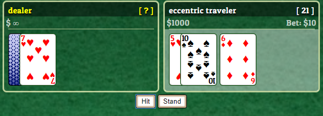

# Rock Paper Blackjack

----
### What is it?
Who doesn't like Blackjack? Make bets. Win. Lose. Don't worry, there's no real money involved! [Check it out](https://snarfblam.github.io/RPB-Multiplayer/).

### How does it work?

Firebase is used to relay messages between clients. The first player to join becomes the host and he runs the host logic as well as the usual client logic. Clients interact by sending messages to the host ('requests') and receiving messages back from the host ('actions'). Should the host disappear, the first client that decides the host timed out takes the throne. Should a player disappear, the host decides when he times out, at which point the current round is scrapped.

About the current state of the project: There simply wasn't enough time to thoroughly debug the software. Everything seems to work, but be warned that when you start the game, __you'll need to wait for previous game to time out__. However, if it all goes to hell, the database can be wiped by opening ***nuke.html***.

### Files
*They're pretty important.*

- index.html - Main interface. Used for both host and client.
- nuke.html - Nuclear option. Clears the database. Use this if things enter an unrecoverable state.
- README.md - You're looking at it.
- dbStructure.txt - Outlines the database structure as well as the messages sent between clients.
- /**assets** - Where I keep the good stuff.
   - /**css** - CSS files.
     - reset.css - Because not all things are created equal. Normalizes styles between browsers.
     - main.css - CSS definitions for index.html/nuke.html
   - /**images** - UI images
   - /**js** - Javascript files
     - app.js - Implements all host/client, firebase, and UI logic
     - nuke.js - With the fire of 10,000 suns. (Used by nuke.html.)

## License
----
All javascript, HTML, and css code in this repository is released under the WTFPL 2 license, i.e. no rights reserved. Other assets are property of their respective owners and should not be distributed.
